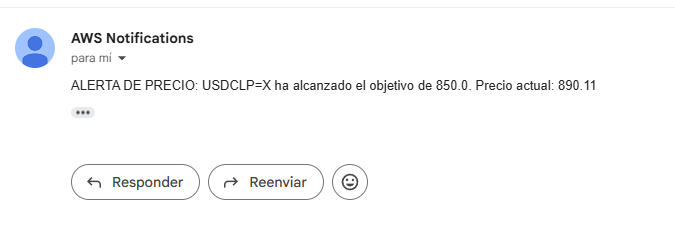

# Stock Market Real-Time Data Analytics Pipeline on AWS ☁️

[](https://opensource.org/licenses/MIT)
[](https://www.python.org/downloads/)

## Overview

This project builds a **real-time stock market data analytics pipeline** using AWS serverless technologies. The architecture ingests, processes, stores, and analyzes stock market data in real-time while minimizing operational costs.

### 🎯 Real-World Use Case: USD/CLP Price Monitoring

**Monitor the Chilean Peso/US Dollar exchange rate (USDCLP=X)** and receive **instant email alerts** when the price reaches your target. This system:
- Fetches live USDCLP prices every 30 seconds
- Detects when the exchange rate reaches a target price (e.g., 850.0 CLP/USD)
- Automatically sends email notifications with the current price and target met
- Stores all historical data for analysis and trend tracking

### 📧 Email Alert Screenshot:


## Key Features

- 📊 **Real-time Data Streaming**: Stream live stock data (e.g., USDCLP) using Amazon Kinesis Data Streams
- 🔍 **Price Target Detection**: Monitor currency pairs and trigger alerts when target prices are reached
- 💰 **Exchange Rate Monitoring**: Track USD/CLP and other currency pairs in real-time
- 📧 **Email Alerts**: Send instant notifications when price targets are achieved
- 💾 **Dual Storage**: Store processed data in DynamoDB for low-latency queries and raw data in S3 for long-term analytics
- 📈 **Historical Analysis**: Query historical data using Amazon Athena
- 🚨 **Smart Alerts**: Send real-time stock trend notifications via AWS Lambda & Amazon SNS (Email/SMS)

## Architecture


## Project Structure

```
Stock-Market-Real-Time-Data-Analytics-Pipeline-on-AWS/
├── Step1/                    # Data Streaming
│   ├── stream_stock_data.py  # Kinesis data producer
│   └── requirements.txt      # Python dependencies
├── Step2/                    # Data Processing
│   └── lambda_function.py    # Lambda processor for anomaly detection
├── Step3/                    # Data Schema
│   └── schema.json          # Athena table schema
├── Step4/                    # Alerting
│   └── lambda_function.py    # Lambda function for SNS alerts
├── README.md                # Project documentation
├── LICENSE                  # MIT License
├── .gitignore              # Git ignore rules
└── .github/
    └── CONTRIBUTING.md     # Contribution guidelines
```

## Quick Start

### Prerequisites

1. **Python 3.8+**
   ```bash
   python --version
   ```

2. **AWS Account** with CLI configured
   ```bash
   aws configure
   ```

3. **AWS Credentials** with appropriate permissions

### Installation

```bash
# Clone the repository
git clone https://github.com/yourusername/Stock-Market-Real-Time-Data-Analytics-Pipeline-on-AWS.git
cd Stock-Market-Real-Time-Data-Analytics-Pipeline-on-AWS

# Install dependencies
pip install -r Step1/requirements.txt
```

### Setup AWS Resources

1. **Create IAM Role** (`StockMarketLambdaRole`) with policies:
   - AmazonKinesisFullAccess
   - AmazonDynamoDBFullAccess
   - AWSLambdaBasicExecutionRole
   - AmazonS3FullAccess
   - AmazonSNSFullAccess

2. **Create AWS Resources**:
   - Kinesis Stream: `stock-market-stream`
   - DynamoDB Table: `stock-market-data`
   - S3 Bucket: `stock-market-data-bucket-{suffix}`

## 📱 Live Example: USD/CLP Price Alerts

This system successfully monitors the USD/CLP exchange rate and sends email alerts when price targets are reached.

### How It Works:
1. **Real-time Monitoring**: Fetches USDCLP=X price every 30 seconds
2. **Target Detection**: Compares current price against your target (e.g., 850.0)
3. **Email Notification**: When the target is reached, sends immediate email alert
4. **Data Storage**: All data stored for historical analysis

### Example Alert Flow:
```
🔄 Fetches current USDCLP price (890.11)
   ↓
📊 Processes and analyzes data
   ↓
🎯 Detects price target achieved (≥850.0)
   ↓
📧 Sends email alert via SNS
   ↓
💾 Stores event in DynamoDB & S3
```

### Email You Receive:
```
From: AWS Notifications <no-reply@sns.amazonaws.com>
Subject: ALERTA DE PRECIO: USDCLP=X ha alcanzado el objetivo de 850.0

ALERTA DE PRECIO: USDCLP=X ha alcanzado el objetivo de 850.0. 
Precio actual: 890.11 CLP/USD
Objetivo: 850.0 CLP/USD
```

## Usage

### Step 1: Stream Stock Data

Start the real-time data streaming producer:

```bash
cd Step1
python stream_stock_data.py
```

This script:
- Fetches live stock data using yfinance (including USDCLP=X for USD/CLP exchange rate)
- Calculates technical indicators and price changes
- Streams data to Kinesis every 30 seconds

**Configuration**:
- Edit `STREAM_NAME` to match your Kinesis stream (default: `stock-market-stream`)
- Modify `STOCK_SYMBOL` to track different assets (default: `USDCLP=X` for USD/CLP)
- Adjust `DELAY_TIME` for streaming frequency (default: 30 seconds)

**Example Configuration for USDCLP Monitoring**:
```python
STOCK_SYMBOL = "USDCLP=X"      # USD/CLP exchange rate
DELAY_TIME = 30                 # Update every 30 seconds
TARGET_PRICE = 850.0            # Alert when price reaches 850 CLP/USD
```

### Step 2: Process Data with Lambda

Deploy `Step2/lambda_function.py` as AWS Lambda function:

**Triggers**: Kinesis stream events

**Functionality**:
- Consumes Kinesis records
- Detects anomalies (>5% price change)
- Stores raw data in S3
- Stores processed metrics in DynamoDB

**Configuration**:
- Set `DYNAMO_TABLE` environment variable
- Set `S3_BUCKET` environment variable

### Step 3: Query with Athena

Use `Step3/schema.json` to create Athena table:

```sql
CREATE EXTERNAL TABLE stock_data_table (
  symbol string,
  timestamp string,
  open double,
  high double,
  low double,
  price double,
  previous_close double,
  volume bigint
)
STORED AS JSON
LOCATION 's3://your-bucket/raw-data/'
```

### Step 4: Send Email Alerts

Deploy `Step4/lambda_function.py` as Lambda function triggered by DynamoDB streams or scheduled events.

**Features**:
- Monitors price movements and detects when targets are reached
- Monitors anomalous price movements (>5% change)
- Sends SNS notifications to Email and SMS subscribers
- Includes current price, target price, and timestamp in alerts

**Email Alert Example**:
```
Subject: ALERTA DE PRECIO: USDCLP=X ha alcanzado el objetivo de 850.0
Body:
ALERTA DE PRECIO: USDCLP=X ha alcanzado el objetivo de 850.0. 
Precio actual: 890.11 CLP/USD
Objetivo: 850.0 CLP/USD
Timestamp: 2024-06-03T14:30:00Z
```

**Configuration for Email Notifications**:
1. Create SNS topic for alerts
2. Subscribe with your email address
3. Configure Lambda environment variables:
   - `SNS_TOPIC_ARN`: ARN of your SNS topic
   - `ALERT_THRESHOLD`: Price change percentage (default: 5%)
   - `TARGET_PRICES`: JSON with symbol and target prices

## SQL Queries for Analysis

### Test Data Availability
```sql
SELECT * FROM stock_data_table LIMIT 10;
```

### Top 5 Stocks by Price Change
```sql
SELECT symbol, price, previous_close,
       (price - previous_close) AS price_change
FROM stock_data_table
ORDER BY price_change DESC
LIMIT 5;
```
Identifies stocks with largest absolute price increases.

### Average Trading Volume per Stock
```sql
SELECT symbol, AVG(volume) AS avg_volume
FROM stock_data_table
GROUP BY symbol;
```
Shows average trading activity for liquidity analysis.

### Anomalous Stocks (>5% Change)
```sql
SELECT symbol, price, previous_close,
       ROUND(((price - previous_close) / previous_close) * 100, 2) AS change_percent
FROM stock_data_table
WHERE ABS(((price - previous_close) / previous_close) * 100) > 5;
```
Identifies unusual market movements for trading opportunities.

## Best Practices

### Security
- Never commit AWS credentials or `.env` files (protected by `.gitignore`)
- Use IAM roles instead of access keys
- Enable S3 bucket encryption
- Implement VPC endpoints for AWS services
- Use CloudTrail for audit logging

### Cost Optimization
- Configure S3 lifecycle policies to archive old data
- Set appropriate Lambda memory allocation
- Use DynamoDB on-demand billing for variable workloads
- Optimize Kinesis shard count based on throughput

### Performance
- Monitor CloudWatch metrics for bottlenecks
- Enable DynamoDB auto-scaling
- Use Kinesis Enhanced Fan-Out for high-throughput scenarios
- Cache frequently accessed data in ElastiCache

## Troubleshooting

### Kinesis Data Not Appearing
- [ ] Verify stream name matches configuration
- [ ] Check IAM role has KinesisFullAccess
- [ ] Ensure stock symbol is valid
- [ ] Check CloudWatch Logs for errors

### Lambda Execution Failures
- [ ] Review CloudWatch Logs for detailed errors
- [ ] Verify environment variables are set
- [ ] Confirm DynamoDB table exists
- [ ] Check S3 bucket permissions

### Query Returns No Results
- [ ] Verify data has been streamed to S3
- [ ] Check Athena table partitions
- [ ] Ensure Glue crawler has run
- [ ] Review S3 bucket path structure

### Performance Issues
- [ ] Monitor Lambda execution time
- [ ] Check DynamoDB throttling
- [ ] Review Kinesis shard utilization
- [ ] Analyze query execution plans

## Contributing

We welcome contributions! Please see [CONTRIBUTING.md](.github/CONTRIBUTING.md) for guidelines on:
- Code standards
- Testing requirements
- Pull request process
- Issue reporting

## License

This project is licensed under the MIT License - see [LICENSE](LICENSE) file for details.

## Acknowledgments

### Original Project
- **Original Author**: [yeshwanthlm](https://github.com/yeshwanthlm)
- **Original Repository**: [Stock-Market-Real-Time-Data-Analytics-Pipeline-on-AWS](https://github.com/yeshwanthlm/Stock-Market-Real-Time-Data-Analytics-Pipeline-on-AWS)
- This project is built upon the excellent AWS serverless architecture foundation created by yeshwanthlm

### Technologies & Libraries
- Built with [yfinance](https://github.com/ranaroussi/yfinance) for real-time stock data
- Serverless architecture using AWS services
- Event-driven processing with Kinesis and Lambda

### Additional Contributors
- Enhanced with USDCLP price monitoring and email alert functionality
- Improved documentation and deployment guides
- Extended for real-world currency trading use cases

## Resources

- [AWS Lambda Documentation](https://docs.aws.amazon.com/lambda/)
- [Amazon Kinesis Developer Guide](https://docs.aws.amazon.com/kinesis/)
- [Amazon DynamoDB Documentation](https://docs.aws.amazon.com/dynamodb/)
- [Amazon Athena Documentation](https://docs.aws.amazon.com/athena/)
- [yfinance GitHub Repository](https://github.com/ranaroussi/yfinance)

## Support

For issues, questions, or suggestions:
1. Check existing issues
2. Review the Troubleshooting section
3. Create a new GitHub issue with detailed information
4. Include error messages and logs when reporting bugs

---

**Last Updated**: June 2026

**Original Author**: [yeshwanthlm](https://github.com/yeshwanthlm)

**Current Maintainer**: Luigi Mattera

**Status**: Active Development - Enhanced Fork with USDCLP Price Alerts

**Note**: This is an enhanced version of the original project with added functionality for USD/CLP price target monitoring and email notifications.
